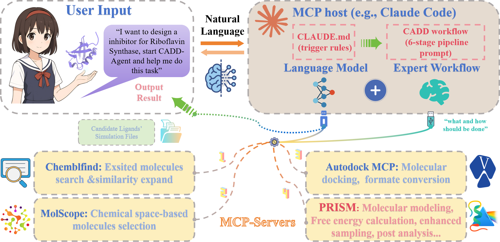

# PRISM - Protein Receptor Interaction Simulation Modeler

PRISM is a comprehensive tool for building protein-ligand systems for molecular dynamics simulations in GROMACS. It supports multiple force fields for ligands including GAFF, GAFF2, OpenFF, CGenFF, OPLS-AA, and SwissParam (MMFF/MATCH/Hybrid).

## Features

- **Multiple Force Field Support**
  - **GAFF/GAFF2** via AmberTools
  - **OpenFF** via openff-toolkit
  - **CGenFF** (CHARMM General Force Field) via web download
  - **OPLS-AA** via LigParGen server
  - **SwissParam** (MMFF/MATCH/Hybrid) via SwissParam server
- **Automatic System Building**: Complete workflow from PDB/MOL2/SDF to simulation-ready files
- **Flexible Configuration**: YAML-based configuration for easy customization
- **Smart File Processing**: Handles various input formats with automatic conversion
- **Position Restraints**: Automatic generation for equilibration protocols
- **Complete MDP Files**: Pre-configured protocols for minimization, equilibration, and production
- **Metal Ion Support**: Intelligent recognition and handling of metal ions (Zn, Ca, Mg, Fe, etc.) with distance-based filtering
- **Advanced Protein Cleaning**: Smart removal of heteroatoms and crystallization artifacts while preserving structural metals
- **Protonation State Prediction**: Optional pKa-based protonation for ionizable residues with PROPKA (HIS/ASP/GLU/LYS/CYS/TYR)
- **Protonation States**: Support for special residue protonation states (CYM, HID, HIE, HIP, CYX, LYN, ASH, GLH)
- CADD-Agent



## Installation

### Prerequisites

1. **GROMACS** (required)

   ```bash
   # Ubuntu/Debian, CUDA-toolkit is needed, Dependence installation
   nvcc --version # For check
   sudo apt-get install gcc
   sudo apt-get install g++
   sudo apt-get install cmake
   
   # Download GROMACS Package
   wget https://ftp.gromacs.org/gromacs/gromacs-2025.1.tar.gz
   tar xfz gromacs-2025.1.tar.gz
   
   # Prepare to build GROMACS with cmake
   cd gromacs-2025.1
   mkdir build
   cd build
   
   # Installation
   cmake .. -DGMX_MPI=ON \
   -DGMX_BUILD_OWN_FFTW=ON \
   -DGMX_GPU=CUDA \
   -DCUDA_TOOLKIT_ROOT_DIR=/usr/local/cuda \
   -DCUDA_INCLUDE_DIRS=/usr/local/cuda/include \
   -DCUDA_CUDART_LIBRARY=/usr/local/cuda/lib64 \
   -DCMAKE_INSTALL_PREFIX=~/gromacs-2025.1
   
   make -j${nproc}
   make check # Optional but recommended
   sudo make install
   source ~/gromacs-2025.1/bin/GMXRC   # match CMAKE_INSTALL_PREFIX above
   
   # install bioconda
   conda install -c bioconda
   ```

2. **Python 3.10** with required packages:

   ```bash
   # create environment 
   conda create -n prism python=3.10
   conda activate prism
   ```

3. **PDBFixer and pyyaml** (required)

   ```bash
   conda install -c conda-forge pdbfixer numpy scipy
   pip install pyyaml
   ```

### Optional Dependencies

#### For Protonation State Prediction (optional):

```bash
# PROPKA for pKa-based protonation prediction (optional)
conda install -c conda-forge propka
# or
pip install propka>=3.4.0

# Or install with PRISM protonation extras
pip install -e .[protonation]
```

### Force Field Specific Dependencies

#### For GAFF/GAFF2 Support:

```bash
# AmberTools (required)
conda install conda-forge::ambertools
# ACPYPE (required)
pip install acpype
# Optional but recommended
conda install -c conda-forge rdkit
```

#### For OpenFF Support:

```bash
# OpenFF toolkit and dependencies
conda install -c conda-forge openff-toolkit openff-interchange

# RDKit (required for SDF handling)
conda install -c conda-forge rdkit

# OpenBabel (Optional but Recommended)
conda install conda-forge::openbabel
```

#### For CGenFF Support:

CGenFF requires downloading force field files from the web server:

1. Visit [https://cgenff.com/](https://cgenff.com/)
2. Upload your ligand structure (MOL2/SDF)
3. Download the generated files (PDB and TOP files)
4. Place them in a directory
5. Use `--forcefield charmm36-jul2022 --ligand-forcefield cgenff --forcefield-path /path/to/cgenff_files`

**Note**: For halogens (F, Cl, Br, I), PRISM automatically removes lone pair (LP) atoms and transfers their charges to halogen atoms.

#### For OPLS-AA Support:

OPLS-AA uses the LigParGen web server (requires internet connection):

```bash
# Required Python packages
pip install requests
```

Usage: `--ligand-forcefield opls`

**Note**: Internet connection required during force field generation.

#### For SwissParam Support (MMFF/MATCH/Hybrid):

SwissParam uses the SwissParam web server (requires internet connection):

```bash
# Required Python packages
pip install mechanize
```

Usage:
- `--ligand-forcefield mmff` (MMFF-based)
- `--ligand-forcefield match` (MATCH)
- `--ligand-forcefield hybrid` (Hybrid MMFF-based-MATCH)

**Note**: Internet connection required during force field generation.

### Installing PRISM

1. Clone or download the PRISM package

2. Install in development mode:

   ```bash
   cd PRISM
   pip install -e .
   ```

Or use directly without installation:

```bash
python /path/to/PRISM/prism/builder.py
```

## Documentation

For detailed tutorials, guides, and API references, visit the **PRISM documentation**:

📚 **[https://prism-tutorial.com/](https://prism-tutorial.com/)**

The documentation includes:
- **Basic Tutorial**: Get started with PRISM from scratch
- **FEP Tutorial**: Learn free energy perturbation calculations
- **Configuration Guide**: Detailed parameter reference
- **Analysis Tools**: Trajectory and energy analysis
- **FEP User Guide**: Complete FEP workflow documentation

## Quick Start

### Protein-pocket ligand generation (experimental)

PRISM provides an orchestration layer for Pocket2Mol, TargetDiff, PocketXMol,
MolCRAFT, FLOWR, and DiffSBDD. The model environments and checkpoints are
deliberately kept outside the PRISM Python environment and run through
configured Docker, Conda, or Slurm backends.

```bash
# Validate and stage a request without launching a model
prism generate \
  --model targetdiff \
  --protein protein.pdb \
  --pocket pocket.pdb \
  --output generated_ligand \
  --dry-run

# The compatibility form is equivalent
prism --generation true \
  --model pocket2mol \
  --protein protein.pdb \
  --pocket reference.sdf \
  --output generated_ligand
```

Repeat `--model` to run several models, or use `--model all`. Pocket inputs are
interpreted by scientific meaning: PDB as a cropped pocket structure,
SDF/MOL/MOL2 as a reference ligand, TXT as a residue list, and YAML as a strict
center/residue/reference specification. Use `--pocket-kind` to make the meaning
explicit and `--reference-ligand` for models such as FLOWR and MolCRAFT.

The CLI distinguishes two generation modes and validates the shared input
before it creates the output directory:

| Mode | Models | Reference-ligand behavior |
|---|---|---|
| Direct | Pocket2Mol, TargetDiff, PocketXMol | No conditioning ligand is required. A ligand may still be supplied as `--pocket` to locate the pocket. A separate unused `--reference-ligand` is rejected. |
| Reference-guided | MolCRAFT, FLOWR | A reference ligand is mandatory. MolCRAFT accepts SDF; FLOWR accepts SDF or PDB. |

For a mixed selection, one reference ligand satisfies every selected model that
requires it; direct models continue to use the normalized pocket geometry. Run
`prism generate --list-models` to inspect the registered modes.

#### Model weights

The checkpoints are about 1 GB in total and are **not** part of the PRISM
package or repository. `prism/data/model_weights/manifest.json` records where
each one belongs, its SHA256, and its licence; the bytes are fetched on demand.

```bash
prism weights list                        # what is needed, what is present
prism weights list --verify               # re-hash everything that is present
prism weights download                    # fetch all six (~966 MiB)
prism weights download --model molcraft   # or just one
prism weights path --model molcraft       # where a checkpoint belongs
prism weights verify --model flowr        # exit non-zero if unusable
```

Weights are stored in `~/.cache/prism/models` by default (`$XDG_CACHE_HOME` is
honored). Set `PRISM_MODELS_DIR` to keep them elsewhere or to point PRISM at a
tree that already exists — a shared cluster directory, for instance.

Every checkpoint comes from the [PRISM mirror](https://github.com/AIB002/PRISM_Model_Weights),
which redistributes each one unmodified under its upstream licence:

| Weights | Licence | Implication |
|---|---|---|
| TargetDiff, Pocket2Mol | MIT | attribution |
| PocketXMol, FLOWR, DiffSBDD | CC BY 4.0 | attribution |
| MolCRAFT | CC BY-NC-SA 4.0 | **NonCommercial**, ShareAlike |

All six licences permit redistribution, and mirroring does not relicense
anything: each artifact keeps its upstream terms, which `prism weights
download` prints as it fetches. Credit the model authors, not PRISM.

The mirror exists because the publishers are hard to fetch from. TargetDiff,
Pocket2Mol and MolCRAFT publish through Google Drive, which defeats scripted
download outright (virus-scan interstitials, per-file quotas, and no access at
all from some networks). The other three are on Zenodo, which is scriptable but
was measured at roughly 15 KB/s, against 966 MiB pulled from the mirror in
261 s (~3.7 MB/s sustained) on the same network — an eleven-hour download for
FLOWR's 600 MiB rather than under three minutes. PocketXMol is worse still at
the source: its 232 MiB checkpoint is published only inside a 611 MiB bundle.

Download integrity is enforced by SHA256 against the manifest, so a truncated
or tampered file is discarded instead of installed. Transfers resume from what
already arrived rather than restarting, which matters on a slow link: a 600 MiB
checkpoint that has to start over on every dropped connection never finishes.
Set `PRISM_MODELS_MIRROR`
to serve the files from your own host (`https://`, or `file://` for an
air-gapped cluster).

A generation run refuses to start if a selected model's weights are missing,
including under `--dry-run`, so a validation pass cannot report PLANNED for a
model that would die on a missing checkpoint.

Copy `prism/configs/generation.yaml`, enable the selected model, and configure a
wrapper command. Commands must be YAML lists (they are never passed through a
shell) and may use placeholders including `{protein}`, `{pocket}`, `{output}`,
`{reference_ligand}`, `{num_samples}`, `{seed}`, `{device}`, `{center_x}`,
`{center_y}`, `{center_z}`, and model-specific values such as `{bbox_size}`.
Pass the file with `--generation-config`.

`prism/configs/generation.local.example.yaml` is a ready-made six-model Conda
configuration with no machine-specific paths in it: it refers to the weights as
`${PRISM_MODELS_DIR}/...` and to the wrappers as `${PRISM_WRAPPERS_DIR}/...`,
and PRISM expands those two names (and only those two) when the file is loaded.

Each model writes an independent status and log directory. Valid 3D SDF records
are split into individual candidate files and also collected into
`candidates.sdf`, `summary.csv`, and `manifest.json` under the requested output
directory. A failed model does not stop the remaining selected models.

TargetDiff has the first concrete runtime contract. Start from
`prism/configs/generation.targetdiff.example.yaml`, replace the image and
checkpoint placeholders with immutable digests, and consult
`prism/generation/environments/targetdiff/README.md`. PRISM can pass a cropped
pocket PDB directly or extract one from a reference ligand, center, or residue
specification. The checkpoint SHA256 is verified before its read-only container
mount; unpinned Docker images are rejected by default.

Pocket2Mol also has a concrete Slurm runtime contract. Start from
`prism/configs/generation.pocket2mol.slurm.example.yaml` and consult
`prism/generation/environments/pocket2mol/README.md`. Its official custom-pocket
entry point requires a full protein PDB, a center, and one cubic side length.
PRISM calculates the center from a reference ligand or cropped pocket structure
and uses at least the official 23 Å box by default. A configured radius takes
precedence as a box of `2 * radius`. Pocket2Mol's official checkpoint is loaded
through a strict pickle allowlist, rewritten to a trusted per-run copy, and
verified by SHA256 before inference.

PocketXMol has a concrete Slurm runtime contract as well. Start from
`prism/configs/generation.pocketxmol.slurm.example.yaml` and consult
`prism/generation/environments/pocketxmol/README.md`. Its custom SBDD path
accepts a full protein PDB plus either a reference ligand or an explicit pocket
center. PRISM defaults to the upstream-recommended 10 Å radius for a reference
ligand and 15 Å for a center, while an explicit pocket radius takes precedence.
The wrapper uses the official model and sampler but replaces the inference
script's training-only PyTorch Lightning import with a minimal feature-dimension
bridge. The published checkpoint is verified, loaded through a strict pickle
allowlist, and rewritten inside the run directory before upstream inference.

MolCRAFT is available through
`prism/configs/generation.molcraft.slurm.example.yaml`; its runtime notes and
noncommercial/share-alike license warning are in
`prism/generation/environments/molcraft/README.md`. The public custom-pocket
path requires a PDB structure plus reference SDF. PRISM extracts center and
residue pockets before launch, reconstructs the checkpoint's embedded config
in an isolated run directory, and skips optional docking-only imports.

FLOWR is available through
`prism/configs/generation.flowr.slurm.example.yaml` and
`prism/generation/environments/flowr/README.md`. It requires a reference SDF or
PDB in this initial integration. The wrapper calls the official rigid-pocket
generator without optional protonation or interaction-recovery evaluation.
Upstream recommends about 40 GB GPU memory, so smaller GPUs may require a
single-molecule smoke test and can still be unsupported. Review the documented
upstream source/checkpoint licensing gap before redistribution.

The pinned MolCRAFT and FLOWR paths have both completed real one-molecule,
10-step GPU smoke runs on a 24 GB RTX 3090. These checks validate installation
and end-to-end SDF production; they are not throughput or quality benchmarks.

Every candidate is quality-checked before it is reported. Molecules that fail
chemically are quarantined with a written repair proposal rather than deleted
or silently corrected, because a bond order that sanitizes is not evidence it
is the one the model intended. Geometry, pose, and plausibility problems are
reported as warnings and do not withhold a molecule. Thresholds are calibrated
so that experimentally determined ligands pass with no flags.

No model emits explicit hydrogens, and parameterization does not reject such a
ligand -- it writes a topology with no hydrogens at all. Use `prism prepare-md`
to export MD-ready ligands from a finished run; it hands over only files
verified to carry hydrogens and prints the build command for them.

```bash
prism prepare-md generated_ligand -o md_inputs --only-pass --limit 10
```

### Basic Usage

1. **Using GAFF (default)**:

   ```bash
   prism protein.pdb ligand.mol2 -o output_dir
   ```

2. **Using GAFF2 (improved GAFF)**:

   ```bash
   prism protein.pdb ligand.mol2 -o output_dir --ligand-forcefield gaff2
   ```

3. **Using OpenFF**:

   ```bash
   prism protein.pdb ligand.sdf -o output_dir --ligand-forcefield openff
   ```

4. **Using CGenFF**:

   ```bash
   # First download CGenFF files from https://cgenff.com/

   # Single ligand:
   prism protein.pdb ligand.mol2 -o output_dir --forcefield charmm36-jul2022 \
     --ligand-forcefield cgenff --forcefield-path /path/to/cgenff_files

   # Multiple ligands (requires one --forcefield-path per ligand):
   prism -pf protein.pdb -lf ligand1.mol2 -lf ligand2.mol2 -o output_dir \
     --forcefield charmm36-jul2022 --ligand-forcefield cgenff \
     -ffp /path/to/cgenff_ligand1 \
     -ffp /path/to/cgenff_ligand2
   ```

5. **Using OPLS-AA**:

   ```bash
   prism protein.pdb ligand.mol2 -o output_dir --forcefield oplsaa --ligand-forcefield opls
   ```

6. **Using SwissParam force fields**:

   ```bash
   # MMFF-based
   prism protein.pdb ligand.mol2 -o output_dir --forcefield charmm36-jul2022 --ligand-forcefield mmff

   # MATCH
   prism protein.pdb ligand.mol2 -o output_dir --forcefield charmm36-jul2022 --ligand-forcefield match

   # Hybrid MMFF-based-MATCH
   prism protein.pdb ligand.mol2 -o output_dir --forcefield charmm36-jul2022 --ligand-forcefield hybrid
   ```

7. **With custom configuration**:

   ```bash
   prism protein.pdb ligand.mol2 -o output_dir --config my_config.yaml
   ```

8. **With specific protein force field**:

   ```bash
   prism protein.pdb ligand.mol2 -o output_dir --forcefield amber14sb --water tip4p
   ```

9. **With advanced protein cleaning**:

   ```bash
   # Keep all metal ions
   prism protein.pdb ligand.mol2 -o output_dir --ion-mode keep_all

   # Remove all metal ions
   prism protein.pdb ligand.mol2 -o output_dir --ion-mode remove_all

   # Custom distance cutoff for metals
   prism protein.pdb ligand.mol2 -o output_dir --distance-cutoff 8.0

   # Keep crystal water molecules
   prism protein.pdb ligand.mol2 -o output_dir --keep-crystal-water
   ```

10. **With protonation prediction (PROPKA)**:

   ```bash
   # Use PROPKA at pH 7.0
   prism protein.pdb ligand.mol2 -o output_dir --protonation propka

   # Custom pH (7.4)
   prism protein.pdb ligand.mol2 -o output_dir --protonation propka --pH 7.4
   ```

### Running MD Simulations

After PRISM completes, you can run the simulations:

```bash
cd output_dir/GMX_PROLIG_MD
```

Create and save `localrun.sh`:

```bash
#!/bin/bash

######################################################
# SIMULATION PART
######################################################

# Energy Minimization (EM)
mkdir -p em
if [ -f ./em/em.gro ]; then
    echo "EM already completed, skipping..."
elif [ -f ./em/em.tpr ]; then
    echo "EM tpr file found, continuing from checkpoint..."
    gmx mdrun -s ./em/em.tpr -deffnm ./em/em -ntmpi 1 -ntomp 10 -gpu_id 0 -v -cpi ./em/em.cpt
else
    echo "Starting EM from scratch..."
    gmx grompp -f ../mdps/em.mdp -c solv_ions.gro -r solv_ions.gro -p topol.top -o ./em/em.tpr -maxwarn 999
    gmx mdrun -s ./em/em.tpr -deffnm ./em/em -ntmpi 1 -ntomp 10 -gpu_id 0 -v
fi

# NVT Equilibration
mkdir -p nvt
if [ -f ./nvt/nvt.gro ]; then
    echo "NVT already completed, skipping..."
elif [ -f ./nvt/nvt.tpr ]; then
    echo "NVT tpr file found, continuing from checkpoint..."
    gmx mdrun -ntmpi 1 -ntomp 10 -nb gpu -bonded gpu -pme gpu -gpu_id 0 -s ./nvt/nvt.tpr -deffnm ./nvt/nvt -v -cpi ./nvt/nvt.cpt
else
    echo "Starting NVT from scratch..."
    gmx grompp -f ../mdps/nvt.mdp -c ./em/em.gro -r ./em/em.gro -p topol.top -o ./nvt/nvt.tpr -maxwarn 999
    gmx mdrun -ntmpi 1 -ntomp 10 -nb gpu -bonded gpu -pme gpu -gpu_id 0 -s ./nvt/nvt.tpr -deffnm ./nvt/nvt -v
fi

# NPT Equilibration
mkdir -p npt
if [ -f ./npt/npt.gro ]; then
    echo "NPT already completed, skipping..."
elif [ -f ./npt/npt.tpr ]; then
    echo "NPT tpr file found, continuing from checkpoint..."
    gmx mdrun -ntmpi 1 -ntomp 10 -nb gpu -bonded gpu -pme gpu -gpu_id 0 -s ./npt/npt.tpr -deffnm ./npt/npt -v -cpi ./npt/npt.cpt
else
    echo "Starting NPT from scratch..."
    gmx grompp -f ../mdps/npt.mdp -c ./nvt/nvt.gro -r ./nvt/nvt.gro -t ./nvt/nvt.cpt -p topol.top -o ./npt/npt.tpr -maxwarn 999
    gmx mdrun -ntmpi 1 -ntomp 10 -nb gpu -bonded gpu -pme gpu -gpu_id 0 -s ./npt/npt.tpr -deffnm ./npt/npt -v
fi

# Production MD
mkdir -p prod
if [ -f ./prod/md.gro ]; then
    echo "Production MD already completed, skipping..."
elif [ -f ./prod/md.tpr ]; then
    echo "Production MD tpr file found, continuing from checkpoint..."
    gmx mdrun -ntmpi 1 -ntomp 10 -nb gpu -bonded gpu -pme gpu -gpu_id 0 -s ./prod/md.tpr -deffnm ./prod/md -v -cpi ./prod/md.cpt
else
    echo "Starting Production MD from scratch..."
    gmx grompp -f ../mdps/md.mdp -c ./npt/npt.gro -r ./npt/npt.gro -p topol.top -o ./prod/md.tpr -maxwarn 999
    gmx mdrun -ntmpi 1 -ntomp 10 -nb gpu -bonded gpu -pme gpu -gpu_id 0 -s ./prod/md.tpr -deffnm ./prod/md -v
fi
```

run `bash localrun.sh`

## Command-Line Parameters

PRISM provides convenient shortcuts for frequently used parameters, allowing you to write more concise commands while maintaining full compatibility with the complete parameter names.

### Common Parameters and Shortcuts

**Basic Setup**
- `-pf, --protein-file`: Protein PDB file path (alternative to positional argument)
- `-lf, --ligand-file`: Ligand structure file (MOL2/SDF) (alternative to positional argument)
- `-o, --output`: Output directory for generated files
- `-c, --config`: Custom configuration YAML file
- `-f, --overwrite`: Force overwrite existing files

**Force Field Options**
- `-ff, --forcefield`: **Protein** force field (e.g., amber99sb, amber14sb, charmm36)
- `-lff, --ligand-forcefield`: **Ligand** force field (gaff, gaff2, openff, cgenff, opls, mmff, match, hybrid)
- `-w, --water`: Water model (tip3p, tip4p, spce)
- `-ffp, --forcefield-path`: Path to CGenFF downloaded files (required for cgenff)

**⚠️ Important Distinction:**
- `-pf`/`-lf` are for **file paths** (where to find protein/ligand files)
- `-ff`/`-lff` are for **force fields** (which force field to use for protein/ligand)

**System Configuration**
- `-d, --box-distance`: Distance from protein to box edge in nm (default: 1.5)
- `-bs, --box-shape`: Simulation box shape (cubic, dodecahedron, octahedron)
- `-t, --temperature`: Simulation temperature in Kelvin (default: 310)
- `-p, --pressure`: Simulation pressure in bar (default: 1.0)

**Ion Parameters**
- `-sc, --salt-concentration`: Salt concentration in M (default: 0.15)
- `-pion, --positive-ion`: Positive ion type (default: NA)
- `-nion, --negative-ion`: Negative ion type (default: CL)

**Protein Preparation Parameters**
- `-im, --ion-mode`: Ion handling mode (smart, keep_all, remove_all; default: smart)
- `-dc, --distance-cutoff`: Distance cutoff for metal ions in Å (default: 5.0)
- `-kcw, --keep-crystal-water`: Preserve crystal water molecules (default: false)
- `-nra, --no-remove-artifacts`: Keep crystallization artifacts (default: false)
- `-proton, --protonation`: Protonation method (`gromacs` or `propka`; default: gromacs)
- `--pH`: Target pH for protonation prediction (default: 7.0)

**MM/PBSA Analysis**
- `-pbsa, --mmpbsa`: Run MM/PBSA binding energy calculation
- `-m, --mode`: MM/PBSA mode (single-frame or trajectory)
- `-s, --structure`: Structure file for single-frame calculation
- `-sd, --system-dir`: PRISM-generated system directory
- `-po, --mmpbsa-output`: Output directory for MM/PBSA results

### Usage Examples with Shortcuts

**Quick start with minimal typing:**
```bash
prism protein.pdb ligand.mol2 -o output -f
```

**Specify force fields using shortcuts:**
```bash
prism protein.pdb ligand.mol2 -o output -ff amber14sb -lff gaff2 -w tip4p
```

**Customize system parameters:**
```bash
prism protein.pdb ligand.mol2 -o output -d 2.0 -t 300 -sc 0.1 -f
```

**Run MM/PBSA calculation:**
```bash
prism -pbsa -m single-frame -s em.gro -sd system_dir -f
```

**Mix shortcuts and full names (fully compatible):**
```bash
prism protein.pdb ligand.mol2 -o output --forcefield amber99sb -lff openff --box-distance 1.8
```

**Advanced example combining multiple options:**
```bash
prism protein.pdb ligand.sdf \
    -o my_simulation \
    -ff amber14sb \
    -lff openff \
    -w tip4p \
    -d 2.0 \
    -t 310 \
    -sc 0.15 \
    -f
```

All shortcuts are designed to be intuitive while maintaining backward compatibility with existing scripts that use full parameter names.

## Force Field Selection Guide

### When to Use Each Force Field

| Force Field | Best For | Pros | Cons | Internet Required |
|------------|----------|------|------|-------------------|
| **GAFF** | General small molecules | Widely used, well-tested | Older parameters | No |
| **GAFF2** | General small molecules | Improved over GAFF, better for pharmaceuticals | Newer, less tested | No |
| **OpenFF** | Drug-like molecules | Modern, data-driven parameters | Requires more dependencies | No |
| **CGenFF** | CHARMM compatibility | Consistent with CHARMM protein FF | Manual web download required | For download |
| **OPLS-AA** | All-atom simulations | Good for organic molecules | Internet required | Yes |
| **MMFF** | Quick parameterization | Fast, general purpose | Less accurate for MD | Yes |
| **MATCH** | CHARMM-style parameters | Good transferability | May fail for complex molecules | Yes |
| **Hybrid** | Balanced approach | Combines MMFF and MATCH | Internet required | Yes |

### Special Features

- **Metal Ions**: Automatically recognized and handled (Zn²⁺, Ca²⁺, Mg²⁺, Fe²⁺/³⁺, Cu²⁺, Mn²⁺, etc.)
- **Protonation States**: Support for CYM, HID, HIE, HIP, CYX, LYN, ASH, GLH
- **Halogen Handling**: CGenFF lone pairs (LP) automatically removed and charges transferred

## Protein Preparation

PRISM provides advanced protein preparation with intelligent cleaning and optional protonation state optimization to ensure your protein structure is properly prepared for molecular dynamics simulations.

### Protein Cleaning

The `ProteinCleaner` class automatically processes protein PDB files with intelligent handling of metal ions and crystallization artifacts.

#### Ion Handling Modes

PRISM offers three modes for handling metal ions and heteroatoms:

- **`smart` (default)**: Keeps structural metals (Zn, Mg, Ca, Fe, Cu, Mn, etc.) while removing non-structural ions (Na, Cl, K, etc.)
- **`keep_all`**: Preserves all metal ions and heteroatoms (except water unless specified)
- **`remove_all`**: Removes all metal ions and heteroatoms

**Structural metals preserved in smart mode**: ZN, MG, CA, FE, CU, MN, CO, NI, CD, HG<br>
**Non-structural ions removed in smart mode**: NA, CL, K, BR, I, F, SO4, PO4, NO3, CO3

#### Distance-Based Filtering

Metals are only kept if they are within a specified distance from the protein:
- **Default cutoff**: 5.0 Å
- **Configurable**: Adjust via `--distance-cutoff` parameter
- **Purpose**: Removes distant, non-coordinating metals that may be crystallization artifacts

#### Crystallization Artifact Removal

Common crystallization additives are automatically removed:
- **Polyols**: Glycerol (GOL), ethylene glycol (EDO), MPD
- **PEG oligomers**: PEG, PGE, 1PE, P6G, etc.
- **Sugars**: NAG, NDG, BMA (unless covalently linked to protein)
- **Detergents**: DMS, BOG, LMT, etc.
- **Other additives**: ACT, ACE, FMT, TRS, etc.

#### GROMACS Compatibility

The cleaner automatically handles GROMACS requirements:
- **HETATM → ATOM conversion**: Metal ions are converted from HETATM to ATOM records
- **Chain reassignment**: Proteins and metals are placed in separate chains for pdb2gmx compatibility
- **Terminal atom fixing**: Automatic correction of C-terminal oxygen atoms

### Protonation State Prediction (PROPKA)

PRISM can optionally use PROPKA to predict pKa values and assign protonation states for ionizable residues (HIS/ASP/GLU/LYS/CYS/TYR) at a target pH. It renames residues in the PDB, and GROMACS `pdb2gmx -ignh` regenerates hydrogens based on those states.

#### Features

- **PROPKA integration**: pKa-based ionizable residue prediction
- **pH-based control**: Choose target pH for prediction
- **GROMACS-ready**: Residue renaming for `pdb2gmx` (e.g., HID/HIE/HIP, ASH/GLH, LYN/CYM/TYH)

#### Requirements

```bash
# Install PROPKA (required for protonation prediction)
conda install -c conda-forge propka
# or
pip install propka>=3.4.0

# Or install with PRISM protonation extras
pip install -e .[protonation]
```

#### Protonation Control

- **Method**: Choose `gromacs` (default) or `propka`
- **Target pH**: Configurable pH for PROPKA prediction (default: 7.0)

## Configuration

PRISM uses YAML configuration files for customization. Key parameters include:

- **Force fields**: Choose from AMBER, CHARMM, or OPLS variants
- **Water models**: TIP3P, TIP4P, SPC, SPCE
- **Simulation parameters**: Temperature, pressure, time, etc.
- **Box settings**: Size, shape, solvation
- **Output controls**: Trajectory frequency, compression
- **Protein preparation**: Advanced cleaning and ion handling options
- **Protonation**: Optional pKa-based protonation for ionizable residues with PROPKA

### Protein Preparation Configuration

```yaml
# Protein preparation settings
protein_preparation:
  ion_handling_mode: smart      # keep_all, smart, remove_all
  distance_cutoff: 5.0        # Distance cutoff for metals (Å)
  keep_crystal_water: false    # Preserve crystal water
  remove_artifacts: true      # Remove crystallization artifacts
```

### Protonation Configuration

```yaml
# Protonation state prediction
protonation:
  method: gromacs  # 'gromacs' (default) or 'propka'
  ph: 7.0          # Target pH for PROPKA pKa prediction
```

See `configs/default.yaml` for a complete example.

## File Structure

```
PRISM/
├── prism/                    # Core modules
│   ├── __init__.py
│   ├── builder.py           # Main program
│   ├── forcefield/          # Force field generators
│   │   ├── __init__.py
│   │   ├── base.py         # Base class
│   │   ├── gaff.py         # GAFF force field
│   │   ├── gaff2.py        # GAFF2 force field
│   │   ├── openff.py       # OpenFF force field
│   │   ├── cgenff.py       # CGenFF force field
│   │   ├── opls_aa.py      # OPLS-AA force field
│   │   └── swissparam.py   # SwissParam force fields
│   └── utils/              # Utilities
│       ├── cleaner.py      # Protein cleaning & metal handling
│       ├── system.py       # System building
│       ├── config.py       # Configuration management
│       └── mdp.py          # MDP file generation
├── configs/                 # Example configurations
├── examples/               # Example input files
├── docs/                   # Documentation
└── README.md              # This file
```

## Output Files

PRISM generates a complete set of files ready for MD simulation:

- **Force field files** (directory name depends on force field):
  - `LIG.amb2gmx/` (GAFF/GAFF2)
  - `LIG.openff2gmx/` (OpenFF)
  - `LIG.cgenff2gmx/` (CGenFF)
  - `LIG.opls2gmx/` (OPLS-AA)
  - `LIG.mmff2gmx/`, `LIG.match2gmx/`, `LIG.hybrid2gmx/` (SwissParam)

  Each contains:
  - `LIG.gro`: Ligand coordinates
  - `LIG.itp`: Ligand topology
  - `atomtypes_LIG.itp`: Atom type definitions
  - `posre_LIG.itp`: Position restraints

- **System files** (`GMX_PROLIG_MD/`):
  - `solv_ions.gro`: Complete solvated system
  - `topol.top`: System topology
  - `protein_clean.pdb`: Cleaned protein structure
  - `topol_Protein.itp`: Protein topology
  - `topol_Ion*.itp`: Metal ion topologies (if present)

- **Protocol files** (`mdps/`):
  - `em.mdp`: Energy minimization
  - `nvt.mdp`: NVT equilibration
  - `npt.mdp`: NPT equilibration
  - `md.mdp`: Production run

- **Configuration backup**:
  - `prism_config.yaml`: Complete configuration used for this build

## Troubleshooting

### Common Issues

1. **"Command not found" errors**: Ensure all dependencies are installed and in PATH
   ```bash
   # Check GROMACS
   gmx --version
   
   # Check AmberTools (for GAFF/GAFF2)
   antechamber -h
   
   # Check Python packages
   python -c "import openff.toolkit"  # For OpenFF
   python -c "import requests"         # For OPLS-AA
   python -c "import mechanize"        # For SwissParam
   ```

2. **Force field errors**:
   - **GAFF/GAFF2**: Ensure AmberTools and ACPYPE are installed
   - **OpenFF**: Check openff-toolkit and openff-interchange
   - **CGenFF**: Verify you downloaded the correct files from the web server
   - **OPLS-AA**: Check internet connection and requests package
   - **SwissParam**: Check internet connection and mechanize package

3. **SwissParam errors**:
   - `MATCH ERROR: Could not Finish Charging`: Try `--ligand-forcefield mmff` or `--ligand-forcefield hybrid`
   - Tautomer issues: Use a different force field (GAFF2 recommended)

4. **CGenFF halogen issues**:
   - LP (lone pair) atoms are automatically removed
   - If you see LP-related errors, please report as a bug

5. **Metal ion issues**:
   - PRISM automatically detects common metal ions
   - Supported: Zn, Ca, Mg, Fe, Cu, Mn, Co, Ni, K, Na, Cl
   - If a metal is not recognized, it may be treated as a regular atom

6. **Protonation state issues**:
   - Ensure residues use standard names (CYM, HID, HIE, HIP, CYX, LYN, ASH, GLH)
   - GROMACS pdb2gmx should handle these automatically

7. **Protein Preparation Issues**:

   **PROPKA Not Available**:
   - **Error**: "PROPKA not found" or similar
   - **Solution**: Install with `conda install -c conda-forge propka` or `pip install propka>=3.4.0` (or `pip install -e .[protonation]`)
   - **Note**: If you do not want PROPKA, keep `protonation.method: gromacs` (default)

   **Metal Ions Removed by Distance**:
   - **Message**: "Removed ZN at distance 6.2 Å from protein"
   - **Solution**: Increase distance cutoff if metal is important: `--distance-cutoff 8.0`

   **Unknown Metal/Ion Warnings**:
   - **Message**: "Warning: Unknown metal/ion MO, keeping by default"
   - **Solution**: Add custom metal to keep list in configuration or use `--ion-mode keep_all`

   **PROPKA Renaming Summary**:
   - **Message**: "PROPKA: Renamed X residue(s)"
   - **Note**: This is expected when `--protonation propka` is enabled

   **Terminal Atom Issues**:
   - **Message**: "Fixed C-terminal residues with misplaced oxygen atoms"
   - **Note**: This is normal behavior. PRISM automatically fixes terminal atom naming for GROMACS compatibility

8. **Memory errors**: Large systems may require more RAM, especially during parameterization

### Getting Help

- Check the log files in the output directory
- Ensure input files are properly formatted (PDB/MOL2/SDF)
- Verify all dependencies are correctly installed
- Check PRISM configuration in `prism_config.yaml`
- For internet-based force fields, verify network connectivity

## CADD-Agent: AI-Driven Drug Screening Pipeline

PRISM includes **CADD-Agent**, an AI agent workflow that orchestrates a complete computer-aided drug design pipeline through [Claude Code](https://claude.ai/code) and MCP (Model Context Protocol).

### Pipeline

```
chemblfind (1000) -> MolScope (100) -> AutoDock Vina (top 10) -> PRISM (10 MD systems)
```

| Stage | Tool | Function |
|-------|------|----------|
| 1. Target search | [ChEMBLFind](https://github.com/AIB001/ChEMBLFind) | Search ChEMBL for bioactive molecules |
| 2. Chemical space selection | [MolScope](https://github.com/AIB001/MolScope) | Select representative molecules covering chemical space |
| 3. Molecular docking | [AutoDock Vina MCP](https://github.com/AIB001/AutodockVina_MCP) | Blind docking with AutoDock Vina |
| 4. MD system building | PRISM | Build GROMACS-ready MD systems |
| 5. Stability analysis | PRISM | RMSD, contacts, trajectory analysis |

### Prerequisites

**Python >= 3.10 required** (MCP server libraries `mcp` and `fastmcp` do not support Python 3.9).

```bash
# Create conda environment with Python 3.10+
conda create -n cadd python=3.12
conda activate cadd

# Install computational dependencies
conda install -c conda-forge ambertools openbabel
pip install vina rdkit
```

Install the 4 MCP server packages:

```bash
# 1. ChEMBLFind - ChEMBL molecule search
pip install git+https://github.com/AIB001/ChEMBLFind

# 2. MolScope - Chemical space coverage selection
pip install git+https://github.com/AIB001/MolScope

# 3. AutoDock Vina MCP - Molecular docking
pip install git+https://github.com/AIB001/AutodockVina_MCP

# 4. PRISM (this package)
pip install -e .

# 5. Claude Code (requires Node.js)
npm install -g @anthropic-ai/claude-code
```

### One-Command Setup

Run (packages do not need to be fully installed first — missing ones will be reported):

```bash
prism --add cadd-agent
```

This will:
1. **Auto-detect** installed MCP server paths (Python interpreter, server scripts)
2. **Configure** `~/.claude/settings.json` with found MCP servers (global, works in any directory)
3. **Create** `~/.claude/CLAUDE.md` with CADD workflow trigger rules
4. **Copy** `.mcp.json` and `CLAUDE.md` templates to the current directory
5. **Report** any missing packages with install commands

### Usage

After setup, start Claude Code in any directory containing a protein PDB file:

```bash
mkdir my_project && cd my_project
cp /path/to/protein.pdb .
claude
```

Then simply tell the agent what you want:

> "I want to screen inhibitors for Riboflavin Synthase"

The agent will guide you through the full pipeline, confirming parameters at each step.

### Manual Setup (Alternative)

If you prefer manual configuration, copy the template files from `prism/prompts/resources/`:

```bash
cp prism/prompts/resources/CLAUDE.md ~/.claude/CLAUDE.md
# Then edit ~/.claude/settings.json to add MCP server paths
# (see prism/prompts/resources/.mcp.json for the template)
```

---

## Citation

If you use PRISM in your research, please cite:

**Paper** (methodology and applications):
```bibtex
@article{PRISM,
  title = {PRISM: A High-Throughput Simulation Infrastructure for CADD Agents},
  author = {Shi, Zhaoqi and Gao, Xufan and Xu, Mingyu and Zhu, Xuanyi and Wang, Peng and Yang, Yuxuan and Yang, Zaixing and Zhou, Ruhong},
  year = {2026},
  doi = {https://doi.org/10.64898/2026.04.02.716083},
  publisher = {BioRxiv Preprints},
  url = {https://doi.org/10.64898/2026.04.02.716083}
}
```

**Code** (software archive):
```bibtex
@software{PRISM_Code,
  author = {Shi, Zhaoqi and Gao, Xufan and Xu, Mingyu and Zhu, Xuanyi and Wang, Peng and Yang, Yuxuan and Yang, Zaixing and Zhou, Ruhong},
  title = {PRISM: Protein Receptor Interaction Simulation Modeler},
  year = {2026},
  doi = {https://doi.org/10.5281/zenodo.19163575},
  publisher = {Zenodo},
  url = {https://zenodo.org/records/19163575}
}
```

**Links**:
- Paper: [https://doi.org/10.64898/2026.04.02.716083](https://doi.org/10.64898/2026.04.02.716083)
- Code: [https://doi.org/10.5281/zenodo.19163575](https://doi.org/10.5281/zenodo.19163575)
- Local PDF: [tests/gxf/FEP/plan/2026.04.02.716083v1.full.pdf](tests/gxf/FEP/plan/2026.04.02.716083v1.full.pdf)

## License

PRISM is released under the MIT License. Force field parameters are subject to their respective licenses.
