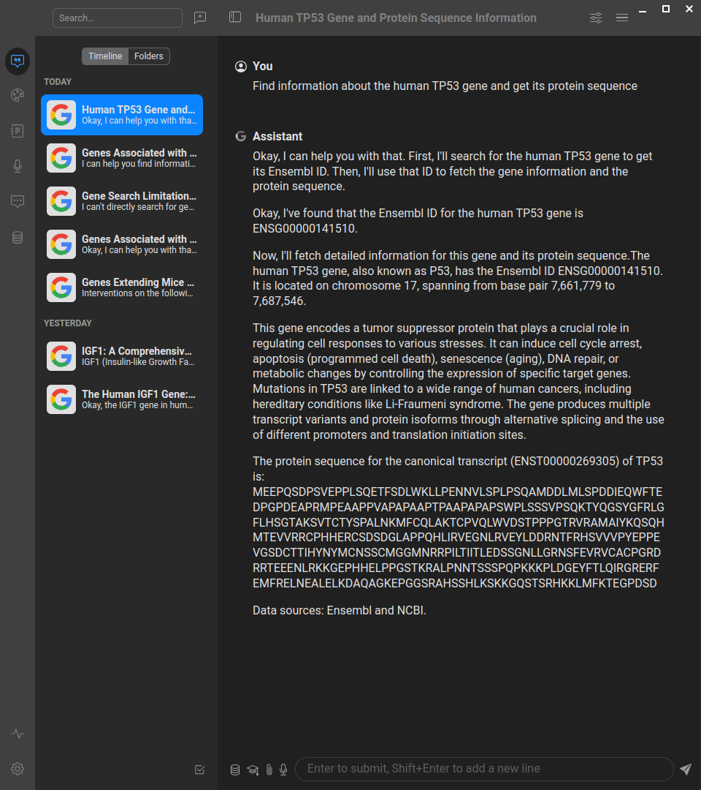

# gget-mcp

[](https://github.com/longevity-genie/gget-mcp/actions/workflows/test.yml)
[](https://badge.fury.io/py/gget-mcp)
[](https://www.python.org/downloads/)
[](https://opensource.org/licenses/MIT)
[](https://github.com/astral-sh/ruff)

MCP (Model Context Protocol) server for the [gget](https://github.com/pachterlab/gget) bioinformatics library.



This server implements the Model Context Protocol (MCP) for gget, providing a standardized interface for accessing powerful bioinformatics tools and databases. MCP enables AI assistants and agents to perform complex genomics queries through structured interfaces.

The gget bioinformatics toolkit provides efficient querying of genomic databases and includes functions for:
- Gene and sequence information retrieval
- BLAST and sequence alignment
- Protein structure prediction
- Gene expression analysis
- Functional enrichment analysis
- And much more!

## 🚀 Quick Example: What Can You Do?

<details>
<summary>See how the gget MCP server works in practice with AI assistants</summary>

**👤 User:** "Analyze the TP53 gene - find its details and protein sequence, then check for cancer mutations"

**🤖 AI Assistant:** I'll help you analyze TP53 step by step:

*[Uses gget_search]* → Found TP53 (ENSG00000141510) on chromosome 17  
*[Uses gget_info]* → TP53 is a protein-coding tumor suppressor gene  
*[Uses gget_seq with translate=True]* → Retrieved 393 amino acid protein sequence  
*[Uses gget_cosmic]* → Found hotspot mutations R175H, R248Q, R273H in multiple cancers

**👤 User:** "Now predict the 3D structure of this protein sequence: MSKGEELFTGVVPILVEL..."

**🤖 AI Assistant:** Let me analyze this sequence:

*[Uses gget_blast]* → Identified as Green Fluorescent Protein (GFP)  
*[Uses gget_alphafold]* → Predicted classic beta-barrel structure with 90%+ confidence

**👤 User:** "Perform pathway enrichment for DNA repair genes: TP53, BRCA1, BRCA2, ATM"

**🤖 AI Assistant:** *[Uses gget_enrichr]* → Top pathways: DNA Damage Response, Homologous Recombination, Cell Cycle Checkpoints, p53 Signaling

**See how powerful this is?** You can now ask natural language questions about genes, sequences, mutations, and pathways - the AI does the complex bioinformatics work for you!

</details>

## About MCP (Model Context Protocol)

<details>
<summary>Learn more about the Model Context Protocol</summary>

MCP is a protocol that bridges the gap between AI systems and specialized domain tools. It enables:

- **Structured Access**: Direct connection to powerful bioinformatics tools and databases
- **Natural Language Queries**: Simplified interaction with complex genomics workflows
- **Type Safety**: Strong typing and validation through FastMCP
- **AI Integration**: Seamless integration with AI assistants and agents

If you want to understand more about what the Model Context Protocol is and how to use it more efficiently, you can take the [DeepLearning AI Course](https://www.deeplearning.ai/short-courses/mcp-build-rich-context-ai-apps-with-anthropic/) or search for MCP videos on YouTube.

</details>

## Available Tools

<details>
<summary>Comprehensive bioinformatics functionality through gget</summary>

### Gene Information & Search
- **`gget_search`**: Find Ensembl IDs associated with search terms
- **`gget_info`**: Fetch detailed information for Ensembl IDs
- **`gget_seq`**: Retrieve nucleotide or amino acid sequences
- **`gget_ref`**: Get reference genome information from Ensembl

### Sequence Analysis
- **`gget_blast`**: BLAST nucleotide or amino acid sequences
- **`gget_blat`**: Find genomic locations of sequences
- **`gget_muscle`**: Align multiple sequences

### Expression & Functional Analysis
- **`gget_archs4`**: Get gene expression data from ARCHS4
- **`gget_enrichr`**: Perform gene set enrichment analysis

### Protein Structure & Function
- **`gget_pdb`**: Fetch protein structure data from PDB
- **`gget_alphafold`**: Predict protein structure using AlphaFold

### Cancer & Mutation Analysis
- **`gget_cosmic`**: Search COSMIC database for cancer mutations

### Single-cell Analysis
- **`gget_cellxgene`**: Query single-cell RNA-seq data from CellxGene

</details>

## Quick Start

<details>
<summary>Installing uv (optional - uvx can auto-install)</summary>

```bash
# Download and install uv
curl -LsSf https://astral.sh/uv/install.sh | sh

# Verify installation
uv --version
uvx --version
```

uvx is a very nice tool that can run a python package installing it if needed.

</details>

### Running with uvx

You can run the gget-mcp server directly using uvx without cloning the repository:

```bash
# Run the server in HTTP mode (default)
uvx gget-mcp http
```

<details>
<summary>Other uvx modes (STDIO, HTTP, SSE)</summary>

#### STDIO Mode (for MCP clients that require stdio)

```bash
# Run the server in stdio mode
uvx gget-mcp stdio
```

#### HTTP Mode (Web Server)
```bash
# Run the server in streamable HTTP mode on default (3002) port
uvx gget-mcp http

# Run on a specific port
uvx gget-mcp http --port 8000
```

#### SSE Mode (Server-Sent Events)
```bash
# Run the server in SSE mode
uvx gget-mcp sse
```

</details>

In cases when there are problems with uvx often they can be caused by cleaning uv cache:
```
uv cache clean
```

The HTTP mode will start a web server that you can access at `http://localhost:3002/mcp` (with documentation at `http://localhost:3002/docs`). The STDIO mode is designed for MCP clients that communicate via standard input/output, while SSE mode uses Server-Sent Events for real-time communication.

**Note:** Currently, we do not have a Swagger/OpenAPI interface, so accessing the server directly in your browser will not show much useful information. To explore the available tools and capabilities, you should either use the MCP Inspector (see below) or connect through an MCP client to see the available tools.

## Configuring your AI Client (Anthropic Claude Desktop, Cursor, Windsurf, etc.)

We provide preconfigured JSON files for different use cases. Here are the actual configuration examples:

### STDIO Mode Configuration (Recommended)

Use this configuration for most AI clients. Use this mode when you want to save large output files (sequences, structures, alignments) to disk instead of returning them as text.
Create or update your MCP configuration file:

```json
{
  "mcpServers": {
    "gget-mcp": {
      "command": "uvx",
      "args": ["--from", "gget-mcp@latest", "stdio"]
    }
  }
}
```

### HTTP Mode Configuration

For HTTP mode:

```json
{
  "mcpServers": {
    "gget-mcp": {
      "command": "uvx",
      "args": ["--from", "gget-mcp@latest", "server"]
    }
  }
}
```

### Configuration Video Tutorial

For a visual guide on how to configure MCP servers with AI clients, check out our [configuration tutorial video](https://www.youtube.com/watch?v=Xo0sHWGJvE0) for our sister MCP server (biothings-mcp). The configuration principles are exactly the same for the gget MCP server - just use the appropriate JSON configuration files provided above.

### Inspecting gget MCP server

<details>
<summary>Using MCP Inspector to explore server capabilities</summary>

If you want to inspect the methods provided by the MCP server, use npx (you may need to install nodejs and npm):

For STDIO mode with uvx:
```bash
npx @modelcontextprotocol/inspector --config mcp-config.json --server gget-mcp
```

You can also run the inspector manually and configure it through the interface:
```bash
npx @modelcontextprotocol/inspector
```

After that you can explore the tools and resources with MCP Inspector at which is usually at 6274 port (note, if you run inspector several times it can change port)

</details>

### Integration with AI Systems

Simply point your AI client (like Cursor, Windsurf, ClaudeDesktop, VS Code with Copilot, or [others](https://github.com/punkpeye/awesome-mcp-clients)) to use the appropriate configuration file from the repository.

## Platform-Specific Setup Guides

### Claude Desktop + gget_mcp Step-by-Step Guide (Windows)

<details>
<summary>Comprehensive Windows setup guide with Google Drive integration</summary>

#### Overview
This guide will walk you through setting up Claude Desktop with the gget_mcp extension and Google Drive integration on Windows. By the end, you'll be able to use Claude to fetch biological data (like gene sequences) and save them directly to your Google Drive folder with offline access.

#### Prerequisites
- Windows PC with administrator access
- Google account
- Stable internet connection

#### Step 1: Set Up Google Drive for Desktop with Offline Access

1. Download and install [Google Drive for Desktop](https://www.google.com/drive/download/)
2. Launch the application and sign in with your user account
3. Connect your project's shared Google account (if applicable)
4. **Configure offline access for your working folder:**
   - Navigate to the folder you want to work with in Google Drive
   - Right-click on the folder (e.g., "work" or your project folder)
   - Select **"Available offline"** from the context menu
   - This makes the folder accessible at a path like `C:\GDrive\holy-bio-mcp\My Disk\work`

   **Important:** This is different from just syncing - offline access ensures the files are locally available while still being part of your Google Drive structure.

#### Step 2: Install Claude Desktop

1. Download [Claude Desktop](https://claude.ai/download) for Windows
2. Run the installer and follow the setup wizard
3. Sign in with your Anthropic/Claude account
4. Complete the initial setup

#### Step 3: Install uv Package Manager

1. Install `uv` using one of these methods:

   **Option A: Using winstall**
   - Visit [https://winstall.app/apps/astral-sh.uv](https://winstall.app/apps/astral-sh.uv)
   - Follow installation instructions

   **Option B: Using PowerShell**
   ```powershell
   powershell -c "irm https://astral.sh/uv/install.ps1 | iex"
   ```

2. Restart your terminal after installation

#### Step 4: Install Node.js

You can install Node.js using either method:

**Option A: Native Installer**
1. Visit [https://nodejs.org/en/download](https://nodejs.org/en/download)
2. Download the Windows installer (LTS version recommended)
3. Run the installer with default settings

**Option B: Using Chocolatey**
```powershell
choco install nodejs
```

Both methods work equally well - choose whichever you prefer.

#### Step 5: Verify Installation & Cache Packages

Open Command Prompt or PowerShell and run:

```bash
uvx --from gget-mcp@latest stdio
```

**Expected behavior:**
- The command should start without errors
- Packages will be downloaded and cached
- If it runs successfully, everything is configured correctly
- You can press `Ctrl+C` to stop it

#### Step 6: Configure Claude Desktop

##### 6.1: Enable Filesystem Extension

1. Open Claude Desktop
2. Go to **Settings** (gear icon)
3. Navigate to the **"Extensions"** tab in the left sidebar
4. Enable the **Filesystem** Extension
5. Add your Google Drive offline folder to the allowed directories (e.g., `C:\GDrive\holy-bio-mcp\My Disk\work`)

**Note:** The Filesystem extension is built into Claude Desktop and uses MCP under the hood, but it's managed directly by the application. You don't need to configure it in the JSON file.

##### 6.2: Add gget_mcp Server

1. In the same manner, go to **Settings**, navigate to the **"Developer"** tab in the left sidebar
2. In **Developer** settings tab, click **"Edit Config"** button
3. This will open the `claude_desktop_config.json` file
4. Edit it and add the gget_mcp server configuration:

```json
{
  "mcpServers": {
    "gget": {
      "command": "uvx",
      "args": [
        "--from",
        "gget-mcp@latest",
        "stdio"
      ]
    }
  }
}
```

5. Save the configuration file

#### Step 7: Restart Claude Desktop

1. Completely close Claude Desktop (check system tray)
2. Restart the application
3. **Note:** On first launch, you might experience a timeout - this is normal
4. If needed, restart Claude Desktop a second time

#### Step 8: Verify Extensions Are Active

1. Open Claude Desktop Settings
2. Go to the **Developer** tab
3. Confirm that both components are enabled:
   - ✅ **Filesystem Extension** - should show your configured Google Drive path and show "Running" status
   - ✅ **gget MCP Server** - should show "Running" status

#### Step 9: Test the Setup

Now let's verify everything works! In Claude Desktop, create a new chat.
Click "Search and tools" icon, select and enable both gget_mcp and filesystem

Try this prompt:

```text
Please search for the COL1A1 gene, retrieve its protein sequence, 
and save it to C:\GDrive\holy-bio-mcp\My Disk\work\test_sequences\ as a FASTA file.
```

**Expected result:**
- Claude will use gget_mcp to search for the gene
- It will fetch the sequence data
- It will save the file to your specified folder
- The file will sync to Google Drive automatically
- Claude will be able to read it using Filesystem Extension.

#### Troubleshooting

##### MCP Server Not Connecting

- Ensure `uv` and `node` are in your system PATH
- Try running the verification command again from Step 5
- Restart Claude Desktop completely

##### Filesystem Permission Errors

- Check that the Filesystem Extension has access to your Google Drive folder
- Verify the folder has offline access enabled in Google Drive
- Try running Claude Desktop as administrator
- Ensure the path is correct (use the exact path shown in File Explorer)

##### Timeout on First Launch

- This is normal - simply restart Claude Desktop
- Wait 10-15 seconds before making requests

##### gget Commands Not Working

- Ensure internet connection is stable (gget fetches from online databases)
- Check that the gget_mcp server shows as "Active" in settings
- Try the verification command from Step 5 again

##### Google Drive Offline Access Issues

- Confirm the folder shows a green checkmark in Google Drive for Desktop
- If files aren't syncing, right-click the folder and re-enable "Available offline"
- Check that you have enough local disk space for offline files

#### Success! 🎉

If everything works correctly, you now have:
- ✅ Claude Desktop with MCP capabilities
- ✅ Access to biological databases via gget_mcp
- ✅ Direct file operations in your Google Drive offline folder
- ✅ Automatic cloud synchronization of all results

You can now ask Claude to fetch gene sequences, protein data, perform BLAST searches, and save everything directly to your Google Drive folder with offline access!

#### Example Use Cases

- **Fetch gene sequences:** "Get the DNA sequence for BRCA1 and save it to my Drive"
- **Protein analysis:** "Find the protein sequence for TP53 and create a markdown report"
- **Bulk operations:** "Search for all genes related to apoptosis and create a summary table"
- **Cross-referencing:** "Get information about COL1A1 from Ensembl and UniProt"

#### Additional Resources

- [gget documentation](https://github.com/pachterlab/gget)
- [Model Context Protocol docs](https://modelcontextprotocol.io/)
- [Claude Desktop support](https://support.anthropic.com/)

*Guide updated: October 13, 2025*

</details>

## Repository setup

<details>
<summary>For developers: cloning and running locally</summary>

```bash
# Clone the repository
git clone https://github.com/longevity-genie/gget-mcp.git
cd gget-mcp
uv sync
```

### Running the MCP Server

If you already cloned the repo you can run the server with uv:

```bash
# Start the MCP server locally (HTTP mode)
uv run server

# Or start in STDIO mode  
uv run stdio

# Or start in SSE mode
uv run sse
```

</details>

## Safety Features

- **Input validation**: Comprehensive parameter validation for all gget functions
- **Error handling**: Robust error handling with informative messages
- **Rate limiting**: Respectful usage of external APIs and databases
- **Data validation**: Type checking and data format validation

## Testing & Verification

<details>
<summary>Developer information: Testing and CI/CD workflows</summary>

The MCP server is provided with comprehensive tests including both unit tests and integration tests for network-dependent operations.

### Running Tests

Run tests for the MCP server:
```bash
# Run all tests (excluding expensive judge tests)
uv run pytest -vvv -m "not judge"

# Run only fast tests (skip slow, integration, and judge tests)
uv run pytest -vvv -m "not slow and not integration and not judge"

# Run only integration tests
uv run pytest -vvv -m integration

# Run judge tests (expensive LLM tests - requires API keys and may cost money)
uv run pytest test/test_judge.py -vvv

# Run tests with coverage (excluding judge tests)
uv run pytest -vvv --cov=src/gget_mcp --cov-report=term-missing -m "not judge"
```

**Note on Judge Tests**: The judge tests (`test_judge.py`) use large language models to evaluate the AI agent's performance with gget tools. These tests:
- Are automatically excluded from CI/CD to avoid costs
- Require API keys (GEMINI_API_KEY or similar) 
- May incur charges from LLM API providers
- Are designed for local development and manual evaluation
- Provide valuable insights into how well the tools work with AI agents

### GitHub Actions Workflows

This project includes several GitHub Actions workflows:

- **CI** (`.github/workflows/ci.yml`): Runs on every push/PR with basic linting and fast tests
- **Tests** (`.github/workflows/test.yml`): Comprehensive testing across multiple OS and Python versions
  - Fast tests on all platforms
  - Integration tests (may require network access)
  - Slow tests (like BLAST operations) - runs only on Ubuntu with Python 3.11
  - Code coverage reporting
  - Security checks with bandit and safety
- **Publish** (`.github/workflows/publish.yml`): Publishes to PyPI when tags are pushed

You can use MCP inspector with locally built MCP server same way as with uvx.

</details>

*Note: Using the MCP Inspector is optional. Most MCP clients (like Cursor, Windsurf, etc.) will automatically display the available tools from this server once configured. However, the Inspector can be useful for detailed testing and exploration.*

*If you choose to use the Inspector via `npx`, ensure you have Node.js and npm installed. Using [nvm](https://github.com/nvm-sh/nvm) (Node Version Manager) is recommended for managing Node.js versions.*

## Example Questions from Test Suite

Here are validated example questions that you can ask the AI assistant when using this MCP server:

* "Find information about the human TP53 gene and get its protein sequence."
* "What are the orthologs of BRCA1 gene across different species?"
* "Perform enrichment analysis for a set of cancer-related genes: TP53, BRCA1, BRCA2, ATM, CHEK2."
* "Get the 3D structure information for the protein encoded by the EGFR gene."
* "Find mutations in the COSMIC database for the PIK3CA gene."
* "Analyze gene expression patterns for insulin (INS) gene across different tissues."
* "Perform BLAST search with a DNA sequence to identify its origin: ATGGCGCCCGAACAGGGAC."
* "Find diseases associated with the APOE gene using OpenTargets."
* "Get reference genome information for mouse (Mus musculus)."
* "Align multiple protein sequences and identify conserved regions."

These questions are taken directly from our automated test suite and are validated to work correctly with the available gget tools.

## Contributing

We welcome contributions from the community! 🎉 Whether you're a researcher, developer, or enthusiast interested in bioinformatics and genomics research, there are many ways to get involved:

**We especially encourage you to try our MCP server and share your feedback with us!** Your experience using the server, any issues you encounter, and suggestions for improvement are incredibly valuable for making this tool better for the entire research community.

### Ways to Contribute

- **🐛 Bug Reports**: Found an issue? Please open a GitHub issue with detailed information
- **💡 Feature Requests**: Have ideas for new functionality? We'd love to hear them!
- **📝 Documentation**: Help improve our documentation, examples, or tutorials
- **🧪 Testing**: Add test cases, especially for edge cases or new query patterns
- **🔍 Data Quality**: Help identify and report data inconsistencies or suggest improvements
- **🚀 Performance**: Optimize queries, improve caching, or enhance server performance
- **🌐 Integration**: Create examples for new MCP clients or AI systems
- **🎥 Tutorials & Videos**: Create tutorials, video guides, or educational content showing how to use MCP servers
- **📖 User Stories**: Share your research workflows and success stories using our MCP servers
- **🤝 Community Outreach**: Help us evangelize MCP adoption in the bioinformatics community

**Tutorials, videos, and user stories are especially valuable to us!** We're working to push the bioinformatics community toward AI adoption, and real-world examples of how researchers use our MCP servers help demonstrate the practical benefits and encourage wider adoption.

### Getting Started

1. Fork the repository
2. Create a feature branch (`git checkout -b feature/amazing-feature`)
3. Make your changes and add tests
4. Run the test suite (`uv run pytest`)
5. Commit your changes (`git commit -m 'Add amazing feature'`)
6. Push to your branch (`git push origin feature/amazing-feature`)
7. Open a Pull Request

### Development Guidelines

- Follow the existing code style (we use `ruff` for formatting and linting)
- Add tests for new functionality
- Update documentation as needed
- Keep commits focused and write clear commit messages

### Questions or Ideas?

Don't hesitate to open an issue for discussion! We're friendly and always happy to help newcomers get started. Your contributions help advance open science and bioinformatics research for everyone. 🧬✨

## Known Issues

<details>
<summary>Technical limitations and considerations</summary>

### External Dependencies
Some gget functions depend on external web services and databases that may occasionally be unavailable or rate-limited. The server implements proper error handling and retries where appropriate.

### Test Coverage
While we provide comprehensive tests including integration tests for network-dependent operations, some test cases may be sensitive to external service availability. Some automated test results may need manual validation.

</details>

## License

This project is licensed under the MIT License.

## Acknowledgments

- [gget](https://github.com/pachterlab/gget) - The amazing bioinformatics toolkit this server wraps
- [FastMCP](https://github.com/jlowin/fastmcp) - The MCP server framework used
- [Model Context Protocol](https://modelcontextprotocol.io/) - The protocol specification

### Other MCP Servers by Longevity Genie

We also develop other specialized MCP servers for biomedical research:

- **[biothings-mcp](https://github.com/longevity-genie/biothings-mcp)** - MCP server for BioThings.io APIs, providing access to gene annotation (mygene.info), variant annotation (myvariant.info), and chemical compound data (mychem.info)
- **[opengenes-mcp](https://github.com/longevity-genie/opengenes-mcp)** - MCP server for OpenGenes database, providing access to aging and longevity research data
- **[synergy-age-mcp](https://github.com/longevity-genie/synergy-age-mcp)** - MCP server for SynergyAge database, providing access to synergistic and antagonistic longevity gene interactions

We are supported by:

[](https://heales.org/)

*HEALES - Healthy Life Extension Society*

and

[](https://ibima.med.uni-rostock.de/)

[IBIMA - Institute for Biostatistics and Informatics in Medicine and Ageing Research](https://ibima.med.uni-rostock.de/)
